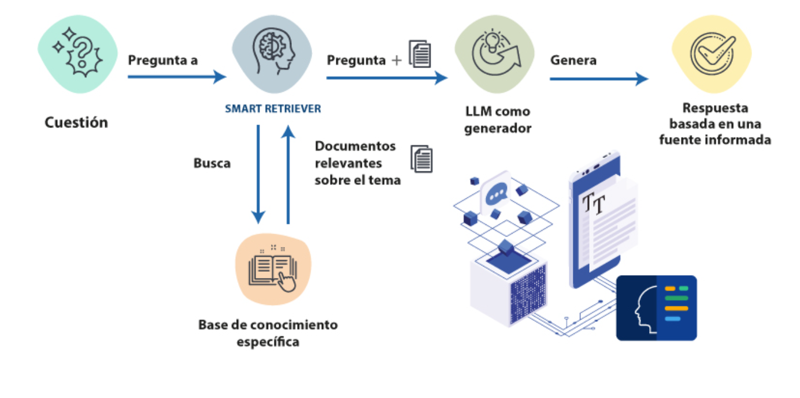
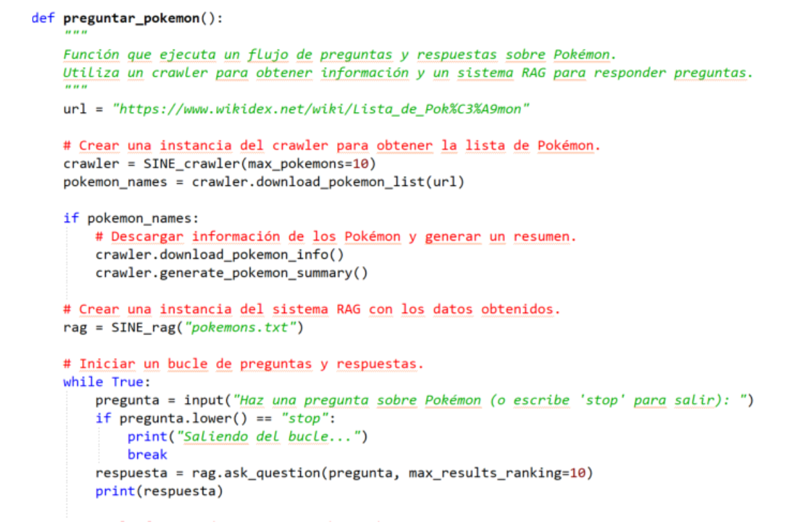

# Sistemas de Información

# No Estructurada

## RAGKEMON: Chatbot experto de

## Pokemons basado en RAG

## Curso 2025-202 6

## 1.- Introducción al problema

Un sistema RAG (Retrieval-Augmented Generation) es una técnica que combina la
recuperación de información con la generación de texto. Estos sistemas se suelen dividir
en tres etapas: en primer lugar, la búsqueda de documentos relevantes en una base de
datos o fuente externa; en segundo lugar, utilizando un sistema de recuperación de
información, se extrae el contexto más relevante de la base de datos en relación con la
consulta del usuario; y, por último, se emplea un modelo de lenguaje grande (LLM, por
sus siglas en inglés, Large Language Model) para generar una respuesta basada en la
información recuperada. Esto mejora la precisión y la exactitud de las respuestas,
evitando depender únicamente de los conocimientos preentrenados del modelo.

En esta práctica, vamos a diseñar un sistema RAG sencillo sobre una temática elegida por
el alumno. Para ello, el alumno deberá diseñar, desarrollar y evaluar aspectos de los tres
módulos que componen un sistema RAG:

1. **Crawler o Araña:** este módulo se encarga de buscar documentos relevantes en
   Internet o fuente externa, generando la “base de datos” que utilizará el módulo de
   recuperación de información para determinar el contexto más adecuado a la
   consulta del usuario.
2. **Sistema de recuperación de información:** este módulo extrae el contexto más
   relevante de la base de datos, generada en el paso anterior, que esté relacionado
   con la consulta del usuario.
3. **Generación de texto:** el último módulo emplea un modelo de lenguaje para
   generar una respuesta basada en la información recuperada por el sistema de
   recuperación y la consulta dada por el usuario.

Los sistemas RAG son actualmente uno de los más utilizados e implementados en los
nuevos sistemas de IA, especialmente en el ámbito empresarial. No obstante, el desarrollo
completo de un sistema RAG complejo es un proceso que excede el alcance de esta
práctica. Por ello, desde el equipo docente, os proponemos un código ya implementado y
funcional de un sistema RAG sencillo especializado en el mundo Pokémon. Para ello, se
ha creado un crawler que extrae toda la información relevante sobre los Pokémon de la
página WikiDex (https://www.wikidex.net/wiki/WikiDex). Esta información es utilizada
por el sistema de recuperación para generar el contexto asociado a la pregunta del usuario.
El funcionamiento detallado de cada módulo será explicado en la siguiente sección. Una
vez aclarado el objetivo de la práctica y su dinámica, el cometido de esta práctica consiste
en:

- **Parte obligatoria:** diseñar, desarrollar y evaluar un sistema RAG especializado
  en una temática elegida por el usuario, diferente a la propuesta incluida en el
  código dado en esta práctica. Para ello, como mínimo, el alumno deberá:

  - **Desarrollar un crawler específico:** ya sea modificando el código
    propuesto o partiendo de un diseño desde cero, el alumno deberá generar
    una base de datos similar a la desarrollada en el sistema base propuesto. Es importante mencionar que cuanto más limpia de ruidos esté la base de datos, mejor funcionará el sistema RAG.
  - Mejorar el sistema de recuperación de información: ya sea mediante la
    implementación de un sistema más complejo que el propuesto, o mediante
    el uso de distintas modificaciones del sistema propuesto (como puede ser
    la función de similitud).
  - Evaluar el sistema de recuperación de información: la evaluación
    automática de los modelos generativos es a día de hoy un problema
    abierto, por lo que en esta práctica se plantea la realización de una
    evaluación manual basada en 10 preguntas en las que el alumno
    comprobará varios aspectos de las mismas: precisión, cobertura de
    información de acuerdo al contexto y veracidad.

- **Parte opcional:** Probar otros modelos de lenguaje, tanto existentes en la librería
  Ollama (utilizada en el código base proporcionado), como otros que se deseen.

Aunque el desarrollo del código base se ha realizado en Python, dada la mayor cantidad
de librerías de IA en este lenguaje, no es requisito el desarrollo de la práctica en este
lenguaje. No obstante, recomendamos siempre partir del código base para facilitar el
desarrollo de la práctica. A continuación, describiremos algunos de los lenguajes más
utilizados, así como las librerías más conocidas en esos lenguajes, para procesamiento de
texto y clasificación automática.

Actualmente, los principales lenguajes de programación utilizados en el área de
procesamiento de texto son Python, Java y R, los cuales cuentan con librerías muy
potentes para tareas de clasificación y procesamiento de lenguaje natural (NLP). En el
caso de Java, aunque con herramientas ya un poco más obsoletas, las librerías GATE
(https://gate.ac.uk/), OpenNLP (https://opennlp.apache.org) y CoreNLP
(https://stanfordnlp.github.io/CoreNLP/) siguen siendo muy utilizadas para
procesamiento de texto, y WEKA (https://www.cs.waikato.ac.nz/ml/weka/) es una de las
más conocidas para tareas de clasificación.

Por su parte, **Python** ha ganado una gran popularidad en el campo de NLP, con librerías
como **NLTK** (https://www.nltk.org/), **SpaCy** (https://spacy.io/) y **Hugging Face's
Transformers** (https://huggingface.co/), que se destacan por su versatilidad y facilidad
de uso. Además, **Scikit-learn** (https://scikit-learn.org/stable/) es ampliamente utilizado
para tareas de aprendizaje automático, y **TensorFlow** (https://www.tensorflow.org/) o
**PyTorch** (https://pytorch.org/) también son muy comunes en el desarrollo de modelos de
deep learning.

En **R** , para el procesamiento de texto, se cuenta con paquetes como **text** (https://cran.r-
project.org/web/packages/text/index.html), que proporciona herramientas modernas de
NLP, y **spacyr** (https://cran.r-project.org/web/packages/spacyr/index.html), una API para
usar la librería SpaCy en R. Para tareas de aprendizaje automático, R dispone de
herramientas como **caret** (https://topepo.github.io/caret/) y **mlr3** (https://mlr3.mlr-
org.com/), que son muy poderosas para modelos predictivos.

En resumen, existen múltiples herramientas en los tres lenguajes, pero Python sigue
siendo el más popular y versátil en el campo del procesamiento de texto y aprendizaje
automático.

A lo largo de esta práctica se irán exponiendo los tres módulos básicos de un sistema
RAG sencillo, así como su implementación incluida en la práctica. A la vez, se irán
proponiendo sugerencias de modificaciones en cada uno de los apartados. Como ya se ha
expuesto, el objetivo de esta práctica es entender el funcionamiento de un sistema RAG
básico, así como modificarlo y mejorarlo mediante diferentes técnicas estudiadas en la
asignatura, presentadas en esta práctica, o incluso nuevas aproximaciones diseñadas por
cada alumno.

## 2.- Arquitectura de un sistema RAG sencillo

Como se puede observar en la imagen, la arquitectura básica de un sistema RAG de
inteligencia artificial está diseñada para responder preguntas utilizando una base de datos
específica. El proceso comienza cuando un usuario formula una pregunta, la cual es
analizada por el sistema de recuperación de información (“Smart retriever” en la imagen).
Este sistema compara la pregunta con su base de datos y recupera los documentos más
relevantes relacionados con la consulta del usuario. En nuestro modelo, esta base de
conocimiento se genera inicialmente por el módulo crawler. Como veremos en las
siguientes secciones, este módulo puede ejecutarse solo una vez al principio o,
alternativamente, puede ser un proceso continuo que actualiza la base de datos con cada
nueva consulta.

Una vez que el sistema de recuperación de información ha determinado los documentos
relevantes, estos se combinan con la pregunta original. Esta combinación de la pregunta
y los documentos se envía a un generador de texto, que es un modelo de lenguaje grande
(LLM, por sus siglas en inglés, Large Language Model). El LLM utiliza esta información
para generar una respuesta coherente y precisa. Finalmente, el sistema presenta al usuario
una respuesta basada en la información encontrada en la base de conocimiento específica.

En resumen, este diagrama ilustra un sistema de recuperación de información que utiliza
una base de datos específica para proporcionar respuestas precisas a las preguntas del
usuario. El proceso incluye la búsqueda de documentos relevantes, la combinación de
estos con la pregunta original y la generación de una respuesta por parte de un modelo de
lenguaje grande.



Esta estructura es la que se ha seguido en el código proporcionado en esta práctica. En
concreto, el flujo principal de ejecución del sistema RAG es:



Este código define una función llamada _preguntar_pokemon()_ , que permite al usuario
interactuar con el sistema RAG especializado en Pokémon. En la primera etapa, el módulo
_crawler_ descarga la información necesaria, comenzando con una lista de Pokémon desde
la página de WikiDex, utilizando para ello la clase _SINE_crawler_ , que se describirá más
adelante. El _crawler_ no solo obtiene los nombres de los Pokémon, sino que también
recoge información detallada sobre ellos y genera un resumen con datos limpios y libres
de ruidos, que se guarda en un archivo.

En una segunda etapa, se crea un objeto del sistema RAG, la clase _SINE_rag_ , utilizando
el archivo _"pokemons.txt"_ , que contiene toda la información recopilada por el _crawler_.
Una vez inicializado el sistema RAG, se entra en un bucle que permite al usuario hacer
preguntas sobre el mundo Pokémon. Al realizar la consulta, el módulo RAG lleva a cabo
una búsqueda utilizando su sistema de recuperación de información. El contexto
recuperado, junto con la consulta, es procesado por el LLM para generar la respuesta
final. El bucle continúa hasta que el usuario decide escribir _"stop"_ , momento en el cual el
programa finaliza la interacción.

## 2.1 Modulo Crawler

Un _crawler_ es una herramienta automatizada que recorre la web para recolectar
información de diversas fuentes. Su función principal es explorar páginas web, acceder a
contenido y extraer datos relevantes para almacenarlos en una base de datos. Estos datos
pueden provenir de diferentes fuentes, como sistemas wiki, donde se encuentra
información estructurada sobre una amplia variedad de temas, conjuntos de noticias de
distintos periódicos, que ofrecen contenido actualizado y variado, o redes sociales, que
proporcionan datos más dinámicos y en tiempo real.

Sin embargo, la información extraída por un _crawler_ suele estar desordenada y puede
incluir contenido no relevante, como anuncios, metadatos, imágenes innecesarias o textos
no estructurados. Por ello, es fundamental realizar un posproceso que limpie y filtre estos
datos, eliminando el ruido y dejando solo la información útil y relevante. Este paso es
crucial para garantizar que los datos recuperados estén en un formato adecuado para ser
utilizados en un sistema RAG. La limpieza de los datos asegura que los modelos de
recuperación y generación de texto puedan acceder a información precisa y coherente, lo
que mejora significativamente la calidad y efectividad de las respuestas proporcionadas
por el sistema.

En un sistema RAG, el _crawler_ puede ejecutarse en diversas etapas, dependiendo de la
naturaleza de la información que se desea recuperar. Si se espera que la información no
cambie rápidamente, el _crawler_ puede ejecutarse al inicio del sistema para recolectar los
datos iniciales. Si se espera que la información cambie de manera constante, se puede
configurar el _crawler_ para que se ejecute cada cierto periodo de tiempo, garantizando que
la base de datos esté siempre actualizada. En casos donde la información es muy
dinámica, como en las redes sociales o noticias en tiempo real, el _crawler_ podría
ejecutarse en cada consulta del usuario, asegurando que la información recuperada esté
siempre lo más actualizada posible.

La función para descargar información en el código proporcionado en la asignatura está
incluida en la clase _SINE_crawler_ , diseñada para extraer información sobre Pokémon
desde la página de WikiDex. Esta implementación es ad-hoc al problema planteado, por
lo que cada alumno deberá realizar su propio implementación de acuerdo a la fuente de
datos especifica que seleccione.

A continuación, se describen los métodos incluidos en la clase _SINE_crawler_ para su
compresión, dado que los pasos seguidos son en su mayoría necesarios en todo modulo
_crawler_ :

1. **Método** \***\*_init_\*\*** : inicializa la clase, configurando la URL base de WikiDex y el
   número máximo de Pokémon a descargar. Si no se especifica un número máximo
   los procesos pueden ser muy largos, por lo que es conveniente incluir este tipo de
   parámetros, especialmente para la realización de pruebas.
2. **Método** **_download_pokemon_list_** : este método descarga la lista de Pokémon
   desde una página de WikiDex proporcionada. Utiliza una expresión regular para
   extraer los nombres de los Pokémon de la página y los guarda en un archivo de
   texto. Si se define un límite ( _max_pokemons_ ), el método solo descargará hasta ese
   número de Pokémon.

3. **Método** **_download_pokemon_info_** : una vez descargada la lista de Pokémon, este
   método obtiene la información detallada de cada uno de ellos. Para cada Pokémon,
   construye la URL correspondiente, descarga la página de WikiDex, y guarda el
   HTML en un archivo individual. Después, limpia la página HTML para dejar solo
   las secciones relevantes, como la "Biología" y "Evolución". En particular nos
   hemos centrado en esas dos secciones para eliminar posibles ruidos del sistema
   con el resto de secciones al contener mucho contenido multimedia mucho más
   complejo de procesar.
4. **Método** **_clean_pokemon_page_** : este método procesa el archivo HTML de cada
   Pokémon, extrayendo solo la información de las secciones "Biología" y
   "Evolución". La información de evolución es limpiada para convertirla en una
   sola frase sin puntuación. Luego, genera un archivo de texto con la información
   limpia. Para ello, hace uso de los métodos **_extract_section_text_** , este método
   extrae el texto de una sección HTML dada (como "Biología" o "Evolución"),
   eliminando elementos innecesarios como subencabezados o listas. El método

```
clean_evolution_text , limpia el texto de la sección de evolución, eliminando la
puntuación y los espacios extra, para dejarlo en una sola frase continua.
```

5. **Método** **_generate_pokemon_summary_** : este método lee los archivos de texto
   generados para cada Pokémon, los combina en un solo archivo de resumen y
   guarda el resultado en un archivo especificado. Cada Pokémon tiene su
   información organizada por nombre y con un formato limpio. Este documento
   final se ha generado para incorporar de una forma sencilla toda la información al
   modelo RAG, aunque se podría cargar la información desde múltiples archivos.

En resumen, la clase _SINE_crawler_ descarga información de Pokémon, la limpia y la
organiza en archivos de texto. Así mismo, proporciona funcionalidades para descargar la
lista de Pokémon, obtener detalles de cada uno, limpiar la información extraída y generar
un resumen consolidado de todos los Pokémon procesados. Este mismo proceso, o
similar, debe ser realizado por el _crawler_ implementado por los alumnos sobre la fuente
de información seleccionada.

## 2.2 Modulo de Recuperación de información

Un **sistema de recuperación de información** (IR, por sus siglas en inglés) es un sistema
diseñado para buscar y recuperar información relevante de una base de datos o colección
de documentos en respuesta a una consulta, como una pregunta o un término de búsqueda.
En los sistemas RAG estos sistemas son utilizados para proporcionar el contexto
adecuado al generador de texto, ayudando así a la precisión de la respuesta y a la
disminución de respuestas erróneas o _alucinaciones_.

El funcionamiento básico de un sistema de recuperación de información involucra varios
pasos:

1. **Indexación** : el sistema organiza los documentos y los convierte en un formato
   que facilita la búsqueda rápida. Esto se hace utilizando algoritmos que identifican
   palabras clave o características importantes de cada documento.
2. **Consulta** : e l usuario ingresa una consulta, que puede ser una palabra o frase.
3. **Recuperación** : el sistema compara la consulta con los documentos indexados y
   selecciona aquellos que son más relevantes basándose en criterios como la
   coincidencia de palabras clave o la similitud semántica.
4. **Ranking** : los resultados recuperados se ordenan, generalmente en función de su
   relevancia que variará en función del problema.

El código proporcionado por el equipo docente que abarca el sistema de recuperación de
información está incluido en la _SINE_rag_ por simplicidad. En concreto, el sistema
desarrollado es un sistema muy básico que hace uso de una función de similitud simple,
como es la similitud por coseno, comparando con todos los documentos y generando un
ranking en base a esa similitud. En este contexto, el sistema utiliza _chunks_ de datos, que
son fragmentos de texto extraídos de la información del módulo _crawler_. Estos
fragmentos se almacenan en la base de datos junto con sus representaciones de
_embeddings_ , que son vectores numéricos que capturan las características semánticas del

texto. Cada _chunk_ se procesa utilizando un modelo de _embedding_ , y la base de datos
resultante, _VECTOR_DB_ , contiene tuplas de tipo ( _chunk_ , _embedding_ ).

La función de similitud juega un papel fundamental en esta recuperación. Se utiliza para
comparar la similitud entre el _embedding_ de una consulta (la pregunta del usuario) y los
_embeddings_ de los _chunks_ almacenados en la base de datos. Para ello, como se ha dicho,
se emplea la similitud coseno, que calcula el coseno del ángulo entre dos vectores. Esta
medida indica qué tan similares son los vectores, y por lo tanto, qué tan relevantes son
los _chunks_ para la consulta. Este cálculo se realiza entre el _embedding_ de la consulta y los
_embeddings_ de los _chunks_ almacenados.

Una vez realizados los cálculos de similitud entre la consulta y la base de datos se realiza
un ranking de los resultados. Una vez calculada la similitud de cada _chunk_ con la consulta,
el sistema ordena los _chunks_ en función de su similitud, de mayor a menor. Finalmente,
los top N resultados más relevantes basados en esta clasificación son seleccionados como
contexto para el sistema de generación de texto. El número de resultados puede ajustarse
a través del parámetro _top_n_ en el método _retrieve_function_.

Además de la similitud coseno, es importante señalar que la función de similitud utilizada
puede ser cambiada por otros métodos, dependiendo de las necesidades del sistema. Por
ejemplo, se podrían usar otras métricas como la distancia Euclidea, la similitud de
Jaccard, entre otras, dependiendo del tipo de datos y el contexto.

Precisamente este es uno de los objetivos de la práctica, modificar el sistema de
recuperación de información de acuerdo a las necesidades del sistema propuesto, ya sea
mediante el uso de otra función de similitud o mediante un sistema de indexación más
complejo, o el uso de un sistema previo de filtrado de documentos más sofisticado.

## 2.3 Generador de textos

Un chatbot basado en un **Large Language Model (LLM)** es un sistema de inteligencia
artificial que procesa lenguaje natural para responder preguntas o interactuar con los
usuarios de manera conversacional. Estos chatbots utilizan modelos de lenguaje
avanzados que han sido entrenados con grandes volúmenes de datos para comprender y
generar texto de manera coherente y útil. Para mejorar la precisión de sus respuestas, estos
chatbots se integran en sistema **RAG** , como es el objetivo de esta práctica, donde primero
se busca la información relevante en una base de datos antes de generar una respuesta con
el modelo de lenguaje.

Dada la complejidad de estos sistemas, y puesto que su implementación requiere de un
alto coste y escapa al ámbito de esta asignatura, simplemente nos vamos centrar en su uso
de acuerdo al código propuesto en la práctica. Como se puede ver, la función _ask_question_
es la parte esencial del sistema de chatbot basado en un **Large Language Model (LLM)**
con recuperación de información. Al estar incluido en un sistema RAG, las respuestas
generada al usuario hacen uso del contexto identificado como valido por el módulo de
recuperación de información.

El proceso comienza con la recuperación de los fragmentos más relevantes haciendo uso
de la función _retrieve_function_ , que es la encargada del módulo de recuperación de
información. Una vez obtenida la lista de los fragmentos más similares a la pregunta,
ordenados por su nivel de similitud, se construye un **prompt** para el modelo de lenguaje.
Este _prompt_ no es más que una consulta con un formato especifico que indica al modelo
que debe usar únicamente los fragmentos recuperados para generar la respuesta y evitar
información inventada. La estructura del mensaje sigue el formato de conversación de los
modelos de lenguaje, donde se incluyen tanto el rol del sistema (que proporciona contexto
e instrucciones) como el rol del usuario (que formula la pregunta).

Finalmente, la consulta junto con el contexto recuperado se envía al modelo de lenguaje
a través de _ollama.chat_ , una librería de Python que funciona como interfaz a varios LLMs
actuales. La respuesta se genera en tiempo real y se imprime directamente en la consola
a medida que el modelo la va produciendo. Es interesante resaltar que Ollama permite
acceso a diferentes LLMs, lo que permite jugar con diferentes tipos de modelos que
variaran su precisión y acierto dependiendo del modelo y su tamaños, lo que resulta muy
interesante de cara a la evaluación para esta práctica.

Para ejecutar los modelos de Ollama no se necesita tener acceso a un servidor o servicio
en la nube, ya que se puede ejecutar los modelos directamente en el ordenador. Para ello,
es necesario descargar el programa de Ollama de la página web: https://ollama.com/. Una
vez instalado el programa, se deberá abrir un terminal e instalar los modelos.

```
ollama pull hf.co/CompendiumLabs/bge-base-en-v1.5-gguf
```

```
ollama pull hf.co/bartowski/Llama-3.2-1B-Instruct-GGUF
```

Por último, se debe instalar en Python el paquete de Ollama:

```
pip install ollama
```

Es importante mencionar que, dependiendo del volumen de datos a procesar y la potencia
de cálculo, los tiempos de ejecución de este código pueden variar desde minutos a horas.
Por ello, se ha parametrizado todo permitiendo ejecuciones con pocos datos para la
realización de pruebas.

## 3.- Objetivos de la práctica

Como ya se ha expuesto, el objetivo de la práctica es diseñar y desarrollar un sistema
RAG sencillo sobre una temática elegida por el alumno. Para ello, deberá llevar a cabo
las siguientes tareas, ya sea modificando el código proporcionado o creando uno nuevo.
En concreto, se requerirá lo siguiente:

1. **Crawler o araña** : el alumno deberá diseñar y desarrollar un _crawler_ para un tema
   específico del que sea fácil extraer información de alguna fuente en internet. Para
   ello, puede modificar el código incluido en la práctica o implementar uno propio.
   Es importante tener en cuenta que el proceso de descarga no solo debe almacenar
   la información, sino también limpiarla de cualquier ruido, como publicidad,
   código HTML, etc. Finalmente, el sistema deberá generar una base de datos o un
   resumen de la información descargada, que será utilizada por el módulo de
   recuperación de información ( **parte obligatoria** ).
2. **Sistema de recuperación de información** : el alumno debe diseñar e implementar
   un sistema de recuperación de información que, dada una consulta, recupere un
   conjunto de documentos relevantes o, en su defecto, genere un ranking sobre el
   total. Para ello, como en el módulo anterior, puede modificar el código propuesto
   en la práctica (sistema de indexación, función de similitud, etc.) o diseñar el suyo
   propio ( **parte obligatoria** ).
3. **Evaluación del sistema** : el alumno debe realizar una evaluación manual de la
   siguiente manera:

a) Diseñar 10 preguntas relevantes sobre el tema elegido.

b) Buscar manualmente la respuesta correcta en la colección de documentos.

c) Realizar las preguntas al chatbot tal como se han planteado en el punto a)
y determinar para cada una:

- I. Precisión : evaluar si la respuesta del chatbot es correcta, es decir,
  si responde adecuadamente de acuerdo con la información
  identificada en el punto b).
- II. Cobertura de información : analizar si la respuesta del chatbot se
  ha basado únicamente en el contexto recuperado o si ha incluido
  información adicional.
- III. Veracidad de la información : verificar si la respuesta del chatbot
  contiene información falsa.

A partir de este procedimiento, se deberán extraer conclusiones finales
sobre el funcionamiento del sistema, describiendo sus fortalezas y
debilidades. Todo este proceso debe estar correctamente documentado en
la memoria, así como un documento extra que incluya las preguntas
identificadas en el punto a), las respuesta validas identificadas en el punto
b) y las repuestas automáticas del sistema ( parte obligatoria ).

4. **Modificación de LLMs** : utilizar y evaluar otros modelos de lenguaje disponibles
   en Ollama, o en otras librerías ( **parte opcional** ).
5. **Modificación de representaciones semánticas** : experimentar con el tamaño de
   los _chunks_ y diferentes tipos de _embeddings_ ( **parte opcional** ).

Por último, se deberá realizar una **memoria en pdf, no más de 10 páginas, en la que se
detalle el diseño** de las modificaciones realizadas sobre el sistema RAG básico
propuesto, o la nueva implementación en su caso, su **evaluación** , **análisis de resultados
y conclusiones extraídas**. En concreto la memoria deberá contener:

- Descripción de la implementación realizada, problemas encontrados, soluciones
  aportadas, etc. Esto debe realizarse para cada módulo.
- Descripción de resultados obtenidos para diferentes variables, y de todas las
  alternativas/combinaciones realizadas, con un análisis exhaustivo de los mismos
  en base a las distintas características analizadas.
- Conclusiones que se puedan obtener a partir del análisis de resultados en base a
  las modificación y propuestas realizadas.

La parte opcional puede llegar a sumar 1 punto extra. Nótese que la suma total de la
práctica nunca puede ser superior a 10 puntos.

El script en Python con el sistema RAG básico se encuentra disponible en el archivo
.zip de la práctica, **SINE_Pract_2025_2026.zip** , con el nombre
**SINE_Pract_2025_2026.py**.

## 4.- Documentación a entregar

La documentación a entregar consistirá en **un solo archivo .zip** cuyo nombre incluya el
nombre del alumno. El contenido del archivo incluirá las siguientes carpetas:

- **Sistema** : dentro de esta carpeta estará incluido el código del sistema RAG
  propuesto, así como todos los recursos necesarios para hacerlo funcionar. Es
  importante mencionar que el sistema debe ser ejecutable para aprobar, por lo que
  es necesario incluir un archivo README explicando todos los requisitos
  necesario para que funcione, así como una breve explicación de la forma de
  ejecutarlo.
- **Memoria** : dentro de esta carpeta estará incluida la memoria descrita en el
  apartado 3.
- **Evaluación** : documento con las 10 preguntas, sus soluciones validas, y las
  respuestas del sistema.

Para entregar su práctica el alumno debe acceder a la sección "Evaluación continua" del
Curso Virtual. Si una vez entregada desea corregir algo y entregar una nueva versión,
puede hacerlo las veces que sea necesario hasta la fecha límite. Los profesores no tendrán
acceso a los trabajos hasta dicha fecha, y por tanto no realizarán correcciones o
evaluaciones de la práctica antes de tener todos los trabajos. En ningún caso se enviarán
las prácticas por correo electrónico a los profesores.
